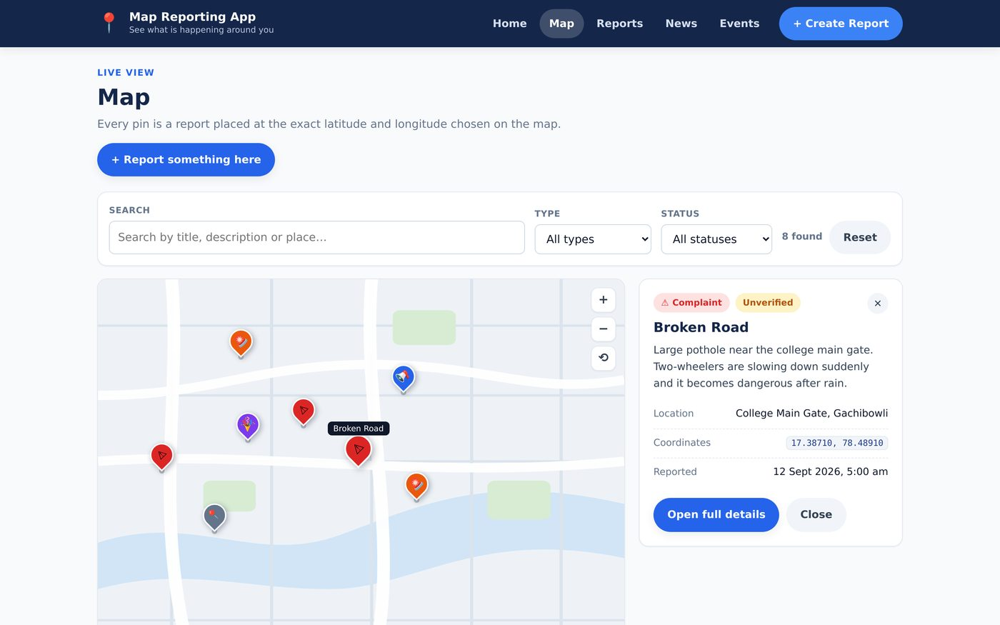

# Map Reporting App — Frontend

A shared map where people report and view what is happening in their local area. A user picks the exact spot on a map, adds a description, a report type and an optional photo, and submits it. That report then appears as a pin for everyone else.

Built with **React + Vite**. This repository contains the **frontend only** — the Google Maps component and the Firebase backend are supplied by the other two teams and plug into two clearly marked files.


## Contents

- [What it does](#what-it-does)
- [Screenshots](#screenshots)
- [Getting started](#getting-started)
- [Project structure](#project-structure)
- [Pages](#pages)
- [Reusable components](#reusable-components)
- [Team integration — the two plug-in points](#team-integration--the-two-plug-in-points)
- [The report data shape](#the-report-data-shape)
- [Responsive design](#responsive-design)
- [What this repository does not contain](#what-this-repository-does-not-contain)

## What it does

- **Home page** — quick access to Map, Reports, News, Events and Create Report, with a live map preview and headline statistics.
- **Map page** — every report as a pin at its exact latitude/longitude, with search, type and status filters, and an information panel that opens when a pin is clicked.
- **Create Report** — the location picker and the report form side by side. Clicking the map drops a pin and the coordinates flow straight into the form.
- **Reports list** — searchable and filterable list of every report, sortable by date or title.
- **Report details** — one report on its own page with a mini map, full description, status and metadata, plus other reports nearby.
- **News** — college news and announcements with a category filter.
- **Events** — upcoming and past events in separate tabs.
- Report types: **Complaint, Incident, Announcement, Event, Other**
- Statuses: **Unverified, In Progress, Resolved, Verified**
- Fully responsive: desktop, tablet and phone, with the navigation collapsing into a hamburger menu on small screens.

## Screenshots

### Map page

Every pin sits at that report's latitude and longitude. Filters above, report list on the right.


### Clicking a pin

The information panel on the right fills in with that report's type, status, description, coordinates and date.



### Create Report

The important screen. The user clicked the map, a pin dropped, and the latitude and longitude (`17.38530, 78.48078`) flowed into the form — see the green "Pin placed" box.


### Report details


### Reports, News and Events

| Reports | News | Events |
|---|---|---|
|  |  |  |

### Mobile

The same pages at 390px wide. Single column, navigation collapsed into a hamburger menu.


## Getting started

**Requirements:** [Node.js](https://nodejs.org) 18 or newer (the green **LTS** button). npm comes with it.

```bash
# 1. install the dependencies (only needed once per copy of the project)
npm install

# 2. start the development server
npm run dev
```

Open the URL it prints — usually <http://localhost:5173>.

Other commands:

```bash
npm run build     # production build into dist/
npm run preview   # serve the production build locally
```

> `npm install` must be run before `npm run dev`, and again if you move the folder to another computer. `node_modules` is not committed to this repository.

## Project structure

```
map-reporting-app/
├── index.html                  the single HTML page React renders into
├── package.json                dependencies and the npm scripts
├── vite.config.js              dev server configuration
│
├── docs/screenshots/           images used by this README
│
└── src/
    ├── main.jsx                entry point — mounts React, enables routing
    ├── App.jsx                 the shell: navbar + footer + the route list
    │
    ├── pages/                  one file per screen (each has its own URL)
    │   ├── Home.jsx            /
    │   ├── MapPage.jsx         /map
    │   ├── Reports.jsx         /reports
    │   ├── ReportDetails.jsx   /reports/:id
    │   ├── ReportPage.jsx      /report          (the create form)
    │   ├── News.jsx            /news
    │   ├── Events.jsx          /events
    │   └── NotFound.jsx        any other address
    │
    ├── components/             reusable UI, used by two or more pages
    │   ├── Navbar.jsx          header, navigation, mobile menu
    │   ├── Footer.jsx
    │   ├── MapView.jsx         ★ the map — placeholder, Maps Team replaces this
    │   ├── MiniMap.jsx         small map on the details page
    │   ├── ReportCard.jsx      one report as a card
    │   ├── ReportForm.jsx      the form fields + validation
    │   ├── ReportFilters.jsx   search box + type/status dropdowns
    │   ├── NewsCard.jsx
    │   ├── EventCard.jsx
    │   ├── Badge.jsx           coloured type and status labels
    │   ├── PageHeader.jsx      the title block on each page
    │   ├── Loader.jsx
    │   └── EmptyState.jsx
    │
    ├── services/               ★ everything that talks to the backend
    │   ├── api.js              ★ the file the Backend Team fills with Firebase
    │   ├── photoUpload.js      photo handling (Step 7)
    │   └── storage.js          small safe localStorage wrapper
    │
    ├── hooks/                  shared data-loading logic
    │   ├── useReports.js       load reports, add a new one
    │   └── useAsyncData.js     reused by News and Events
    │
    ├── utils/
    │   ├── constants.js        report types, statuses, menu items
    │   └── mapMath.js          lat/lng ↔ screen position, date formatting
    │
    ├── data/
    │   └── sampleData.js       dummy reports / news / events
    │
    └── styles/
        └── index.css           all styling, including the responsive rules
```

## Pages

| Route | Page | Notes |
|---|---|---|
| `/` | Home | Hero, statistics, quick access, map preview, latest reports, news and events |
| `/map` | Map | Filters, pins, and an information panel for the selected pin |
| `/reports` | Reports | Search, filter by type/status, sort by date or title |
| `/reports/:id` | Report details | Mini map, description, status, metadata, nearby reports |
| `/report` | Create Report | Location picker + form side by side |
| `/news` | News | College news and announcements with a category filter |
| `/events` | Events | Upcoming and Past tabs |
| `*` | Not found | Any unknown address |

## Reusable components

| Component | Used by | Purpose |
|---|---|---|
| `MapView` | Home, Map, Create Report | The map itself. Shows pins, optionally lets the user pick a location |
| `MiniMap` | Report details | Small read-only map showing one location |
| `ReportCard` | Home, Map, Reports, Report details | One report as a card; links out or reports a click back to the parent |
| `ReportForm` | Create Report | The report fields, validation and photo picker |
| `ReportFilters` | Map, Reports | Search box + type/status dropdowns |
| `NewsCard` / `EventCard` | Home, News, Events | One news item / one event |
| `Badge` | many | Coloured type and status labels |
| `Loader` / `EmptyState` | many | Loading and empty/error states |
| `Navbar` / `Footer` | every page | The shell |
| `PageHeader` | Map, Reports, News, Events | Consistent page title block |

## Team integration — the two plug-in points

The frontend is deliberately built around **two seams**, so neither Google Maps nor Firebase is referenced anywhere in the pages.

### 1. Maps Team → `src/components/MapView.jsx`

`MapView` is currently a placeholder map drawn with HTML, CSS and SVG. It already behaves correctly: it shows a pin per report using real latitude/longitude, and it returns coordinates when the user clicks it.

Replace the block marked `SWAP HERE (Step 5)` with the Maps Team's component, keeping the same props:

| Prop | Direction | Meaning |
|---|---|---|
| `reports` | frontend → maps | array of reports, each with `lat` and `lng` — they draw the pins |
| `selectedLocation` | frontend → maps | `{ lat, lng }` or `null` — they draw the chosen pin |
| `onMapClick` | maps → frontend | called with `(lat, lng)` when the user picks a point |
| `onMarkerClick` | maps → frontend | called with the report when a pin is clicked |
| `activeId` | frontend → maps | which pin to highlight |
| `height` | frontend → maps | how tall the map box should be |

`MiniMap` wraps `MapView` for the details page and only needs `lat` and `lng`.

### 2. Backend Team → `src/services/api.js`

No page or component imports Firebase. Every screen goes through six functions in this one file:

| Function | Input | Returns |
|---|---|---|
| `getReports()` | — | `Promise<Report[]>` |
| `getReportById(id)` | an id | `Promise<Report \| null>` |
| `createReport(input)` | the form values + lat/lng | `Promise<Report>` (the saved one) |
| `getNews()` | — | `Promise<NewsItem[]>` |
| `getEvents()` | — | `Promise<EventItem[]>` |
| `uploadReportPhoto(file)` | a photo file | `Promise<string>` (a URL) |

Keep the names and the return shapes, replace what is inside them, and every page updates at once. Until then the app runs on the dummy data in `src/data/sampleData.js`.

## The report data shape

Every report object — from the backend, from the form, and from the dummy data — has these fields:

```js
{
  id:           'r-1001',                      // string, from the backend
  title:        'Broken Road',
  type:         'Complaint',                   // Complaint | Incident | Announcement | Event | Other
  description:  'Large pothole near the gate.',
  lat:          17.3871,                       // number — comes from the map
  lng:          78.4891,                       // number — comes from the map
  locationName: 'College Main Gate, Gachibowli',
  photoUrl:     'https://...',                 // '' if the user added no photo
  status:       'Unverified',                  // Unverified | In Progress | Resolved | Verified
  reportedBy:   'Sai Teja',                    // 'Anonymous' if left blank
  reportedAt:   '2026-09-12T10:30:00+05:30'    // ISO date-time string
}
```

`createReport()` throws an error if `lat` or `lng` is missing, so a report can never be saved without a location.

## Responsive design

Three breakpoints, all in `src/styles/index.css`:

| Width | Behaviour |
|---|---|
| above 1024px | side panels sit beside the main content |
| 1024px and below | side panels move underneath; hero goes single column |
| 768px and below | one column, navbar collapses into a hamburger menu, cards stack |
| 480px and below | tighter spacing, full-width buttons |

Test at **375px**, **768px** and **1280px**. On a phone connected to the same Wi-Fi, open the URL printed under `Network:` by `npm run dev`.

## What this repository does not contain

Handled by the other teams:

- Google Maps API integration, GPS and the real mini-map — **Maps Team**
- Firebase database, photo storage, authentication — **Backend Team**

By design, the frontend also does not contain any Google Maps API key or Firebase credentials. When those are added, they must go in a `.env` file which is already gitignored — never committed.

## Status

- All pages built and working on dummy data.
- Full flow verified end to end: open map → pick location → fill form → submit → report appears as a pin.
- Responsive at phone, tablet and desktop widths.
- Awaiting the Maps Team's map component and the Backend Team's Firebase code.

See `START-HERE.md` for the original build plan and the step-by-step order this project was built in.
