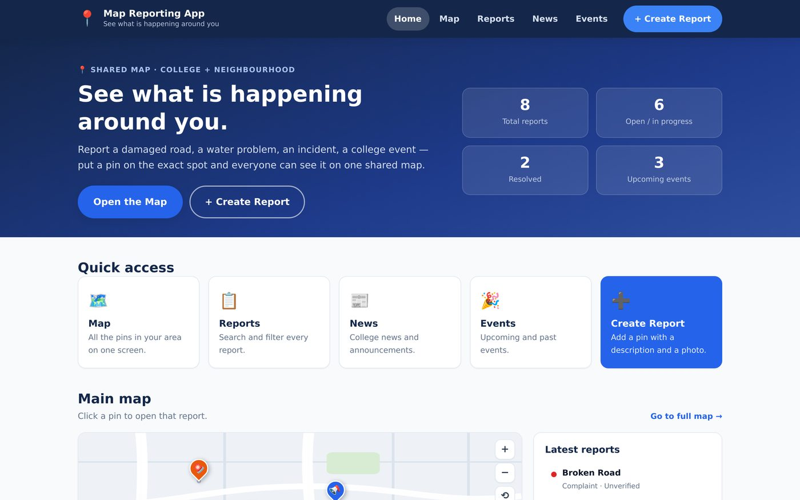
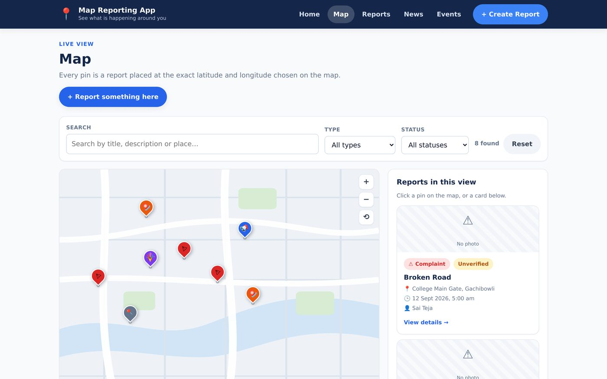
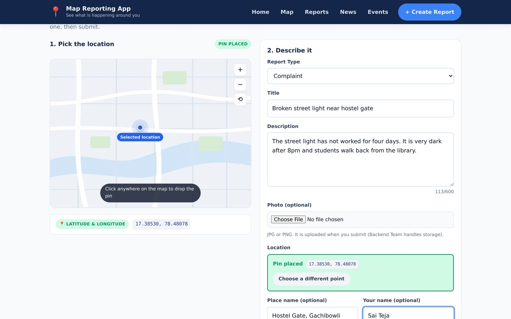
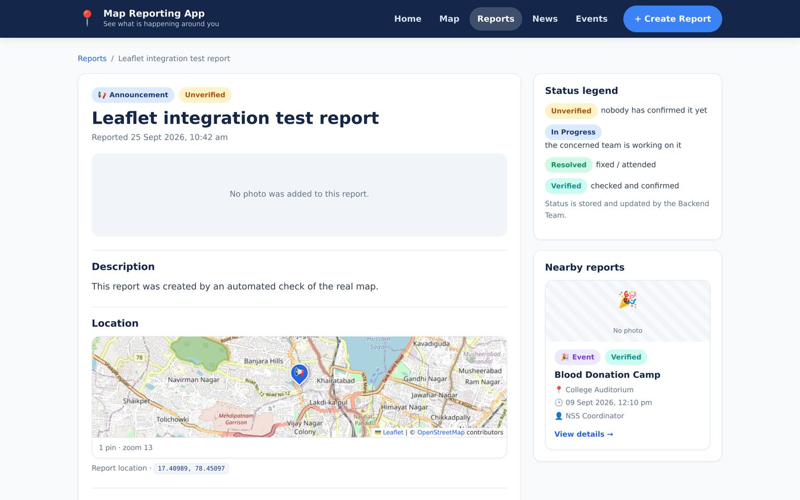
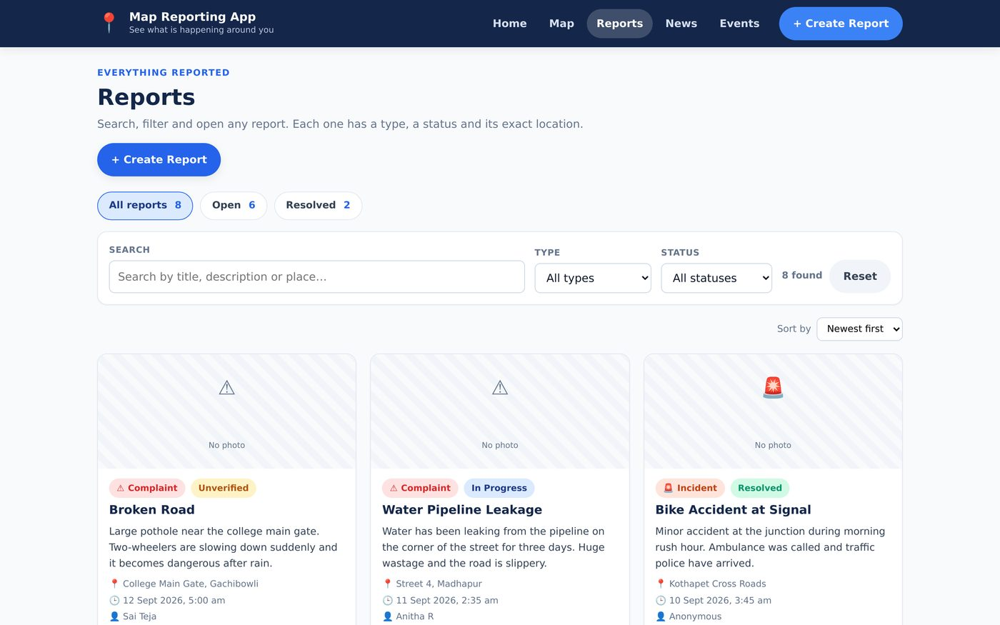
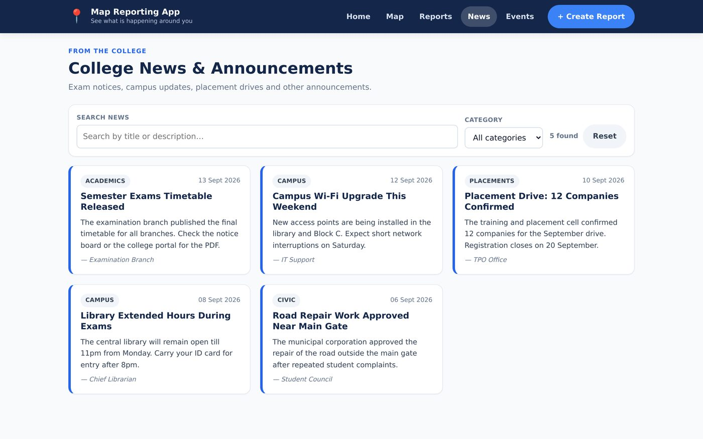
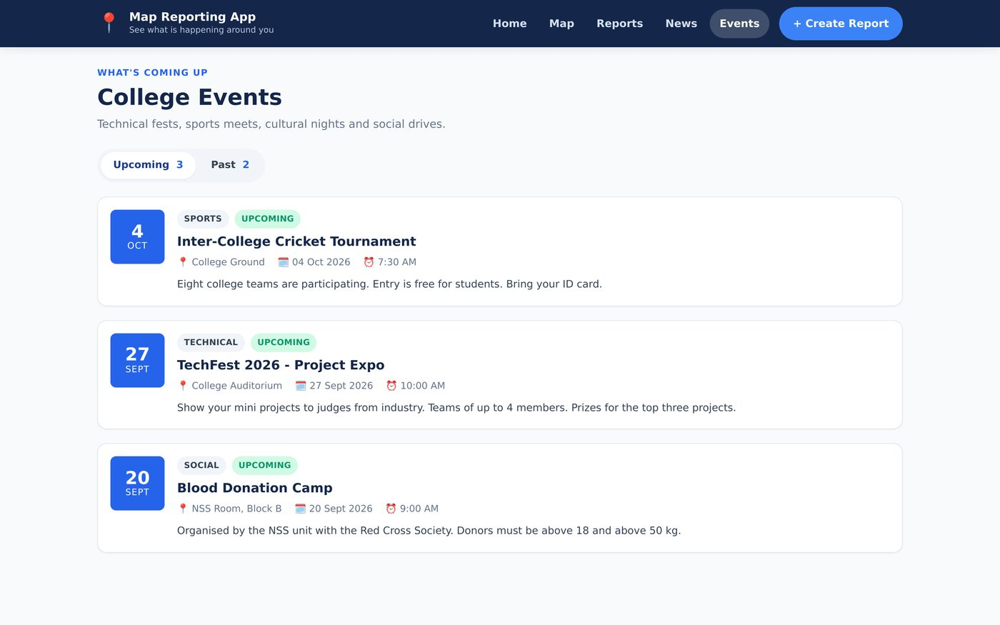
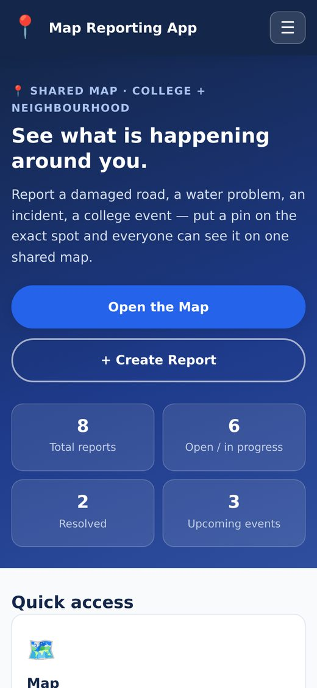
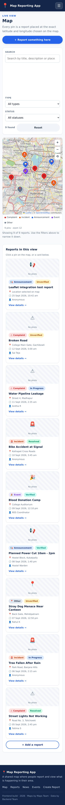

# Map Reporting App — Frontend

A shared map where people report and view what is happening in their local area. A user picks the exact spot on a map, adds a description, a report type and an optional photo, and submits it. That report then appears as a pin for everyone else.

Built with **React + Vite**, with real maps from **Leaflet + OpenStreetMap** (no API key, no billing account, free forever). This repository contains the **frontend only** — the Firebase backend is supplied by the Backend Team and plugs into one clearly marked file.

### Live site

**https://lokeshhhh3.github.io/map-reporting-app/**

No setup needed — just open it in any browser, including on a phone. It rebuilds and republishes automatically on every push to `main`.



## Contents

- [What it does](#what-it-does)
- [Screenshots](#screenshots)
- [Getting started](#getting-started)
- [Deployment](#deployment)
- [Project structure](#project-structure)
- [Pages](#pages)
- [Reusable components](#reusable-components)
- [Team integration — the two plug-in points](#team-integration--the-two-plug-in-points)
- [The report data shape](#the-report-data-shape)
- [Responsive design](#responsive-design)
- [What this repository does not contain](#what-this-repository-does-not-contain)

## What it does

- **Home page** — quick access to Map, Reports, News, Events and Create Report, with a live map preview and headline statistics.
- **Map page** — every report as a pin at its exact latitude/longitude, with search, type and status filters, and an information panel that opens when a pin is clicked.
- **Create Report** — the location picker and the report form side by side. Clicking the map drops a pin and the coordinates flow straight into the form.
- **Reports list** — searchable and filterable list of every report, sortable by date or title.
- **Report details** — one report on its own page with a mini map, full description, status and metadata, plus other reports nearby.
- **News** — college news and announcements with a category filter.
- **Events** — upcoming and past events in separate tabs.
- Report types: **Complaint, Incident, Announcement, Event, Other**
- Statuses: **Unverified, In Progress, Resolved, Verified**
- Fully responsive: desktop, tablet and phone, with the navigation collapsing into a hamburger menu on small screens.

## Screenshots

### Map page

A real OpenStreetMap with a pin per report at that report's latitude and longitude. Filters above, report list on the right. Clicking a pin highlights it and fills the information panel.



### Create Report

The important screen. The user clicked the map, a pin dropped, and the latitude and longitude (`17.38530, 78.48078`) flowed into the form — see the green "Pin placed" box.



### Report details



### Reports, News and Events

| Reports | News | Events |
|---|---|---|
|  |  |  |

### Mobile

The same pages at 390px wide. Single column, navigation collapsed into a hamburger menu.



## Getting started

**Requirements:** [Node.js](https://nodejs.org) 18 or newer (the green **LTS** button). npm comes with it.

```bash
# 1. install the dependencies (only needed once per copy of the project)
npm install

# 2. start the development server
npm run dev
```

Open the URL it prints — usually <http://localhost:5173>.

Other commands:

```bash
npm run build     # production build into dist/
npm run preview   # serve the production build locally
```

> `npm install` must be run before `npm run dev`, and again if you move the folder to another computer. `node_modules` is not committed to this repository.

## Project structure

```
map-reporting-app/
├── index.html                  the single HTML page React renders into
├── package.json                dependencies and the npm scripts
├── vite.config.js              dev server configuration
│
├── docs/screenshots/           images used by this README
├── .github/workflows/deploy.yml  publishes the site on every push to main
│
└── src/
    ├── main.jsx                entry point — mounts React, enables routing
    ├── App.jsx                 the shell: navbar + footer + the route list
    │
    ├── pages/                  one file per screen (each has its own URL)
    │   ├── Home.jsx            /
    │   ├── MapPage.jsx         /map
    │   ├── Reports.jsx         /reports
    │   ├── ReportDetails.jsx   /reports/:id
    │   ├── ReportPage.jsx      /report          (the create form)
    │   ├── News.jsx            /news
    │   ├── Events.jsx          /events
    │   └── NotFound.jsx        any other address
    │
    ├── components/             reusable UI, used by two or more pages
    │   ├── Navbar.jsx          header, navigation, mobile menu
    │   ├── Footer.jsx
    │   ├── MapView.jsx         ★ the map — Leaflet + OpenStreetMap
    │   ├── MiniMap.jsx         small map on the details page
    │   ├── ReportCard.jsx      one report as a card
    │   ├── ReportForm.jsx      the form fields + validation
    │   ├── ReportFilters.jsx   search box + type/status dropdowns
    │   ├── NewsCard.jsx
    │   ├── EventCard.jsx
    │   ├── Badge.jsx           coloured type and status labels
    │   ├── PageHeader.jsx      the title block on each page
    │   ├── Loader.jsx
    │   └── EmptyState.jsx
    │
    ├── services/               ★ everything that talks to the backend
    │   ├── api.js              ★ the file the Backend Team fills with Firebase
    │   ├── photoUpload.js      photo handling (Step 7)
    │   └── storage.js          small safe localStorage wrapper
    │
    ├── hooks/                  shared data-loading logic
    │   ├── useReports.js       load reports, add a new one
    │   └── useAsyncData.js     reused by News and Events
    │
    ├── utils/
    │   ├── constants.js        report types, statuses, menu items
    │   └── mapMath.js          lat/lng ↔ screen position, date formatting
    │
    ├── data/
    │   └── sampleData.js       dummy reports / news / events
    │
    └── styles/
        └── index.css           all styling, including the responsive rules
```

## Pages

| Route | Page | Notes |
|---|---|---|
| `/` | Home | Hero, statistics, quick access, map preview, latest reports, news and events |
| `/map` | Map | Filters, pins, and an information panel for the selected pin |
| `/reports` | Reports | Search, filter by type/status, sort by date or title |
| `/reports/:id` | Report details | Mini map, description, status, metadata, nearby reports |
| `/report` | Create Report | Location picker + form side by side |
| `/news` | News | College news and announcements with a category filter |
| `/events` | Events | Upcoming and Past tabs |
| `*` | Not found | Any unknown address |

## Reusable components

| Component | Used by | Purpose |
|---|---|---|
| `MapView` | Home, Map, Create Report | The map itself. Shows pins, optionally lets the user pick a location |
| `MiniMap` | Report details | Small read-only map showing one location |
| `ReportCard` | Home, Map, Reports, Report details | One report as a card; links out or reports a click back to the parent |
| `ReportForm` | Create Report | The report fields, validation and photo picker |
| `ReportFilters` | Map, Reports | Search box + type/status dropdowns |
| `NewsCard` / `EventCard` | Home, News, Events | One news item / one event |
| `Badge` | many | Coloured type and status labels |
| `Loader` / `EmptyState` | many | Loading and empty/error states |
| `Navbar` / `Footer` | every page | The shell |
| `PageHeader` | Map, Reports, News, Events | Consistent page title block |

## Team integration

No page or component imports a map library or Firebase. Everything outside this project plugs in through **one file each**, so the app keeps working on dummy data until the other teams deliver.

### The map — `src/components/MapView.jsx`

The map is real and already working: **Leaflet + OpenStreetMap**, with a pin per report at its latitude and longitude, click-to-pick-location, hover tooltips, custom zoom controls and a mini map variant.

Leaflet was chosen over Google Maps because it needs **no API key, no Google Cloud account, no billing and no credit card**. (Google Maps Platform has required a billing account with a card on file since 2018, retired its $200 monthly credit in March 2025, and has no spending cap by default.)

`MapView` exposes a fixed props contract. Nothing outside this file imports Leaflet, so swapping the map library means rewriting this one file and nothing else:

| Prop | Direction | Meaning |
|---|---|---|
| `reports` | page → map | array of reports, each with `lat` and `lng` — one pin each |
| `selectedLocation` | page → map | `{ lat, lng }` or `null` — the pin the user just picked |
| `onMapClick` | map → page | called with `(lat, lng)` when the user clicks the map |
| `onMarkerClick` | map → page | called with the report when a pin is clicked |
| `activeId` | page → map | which pin to highlight |
| `height` | page → map | how tall the map box should be, e.g. `'520px'` |
| `showLegend` / `showZoom` | page → map | optional; `MiniMap` turns both off |
| `initialBounds` | page → map | optional; `MiniMap` uses it to frame one point |

`MiniMap` wraps `MapView` for the details page and only needs `lat` and `lng`.

**If a Google Maps version is ever required**, rewrite `MapView.jsx` keeping the same props. No other file changes. Notes for that job: `google.maps.Marker` was deprecated in February 2024 in favour of `AdvancedMarkerElement`, which also requires creating a Map ID in the console.

### The data — `src/services/api.js`

No page or component imports Firebase. Every screen goes through six functions in this one file:

| Function | Input | Returns |
|---|---|---|
| `getReports()` | — | `Promise<Report[]>` |
| `getReportById(id)` | an id | `Promise<Report \| null>` |
| `createReport(input)` | the form values + lat/lng | `Promise<Report>` (the saved one) |
| `getNews()` | — | `Promise<NewsItem[]>` |
| `getEvents()` | — | `Promise<EventItem[]>` |
| `uploadReportPhoto(file)` | a photo file | `Promise<string>` (a URL) |

Keep the names and the return shapes, replace what is inside them, and every page updates at once. Until then the app runs on the dummy data in `src/data/sampleData.js`.

### What is left for the other teams

| Task | Owner | Where it happens |
|---|---|---|
| Firebase database + storage | Backend Team | inside `src/services/api.js` |
| Firebase photo upload | Backend Team | `src/services/photoUpload.js` |
| Authentication (optional) | Backend Team | new file, not written yet |
| A Google Maps version of the map (optional) | Maps Team / Frontend | rewrite `src/components/MapView.jsx` |

## The report data shape

Every report object — from the backend, from the form, and from the dummy data — has these fields:

```js
{
  id:           'r-1001',                      // string, from the backend
  title:        'Broken Road',
  type:         'Complaint',                   // Complaint | Incident | Announcement | Event | Other
  description:  'Large pothole near the gate.',
  lat:          17.3871,                       // number — comes from the map
  lng:          78.4891,                       // number — comes from the map
  locationName: 'College Main Gate, Gachibowli',
  photoUrl:     'https://...',                 // '' if the user added no photo
  status:       'Unverified',                  // Unverified | In Progress | Resolved | Verified
  reportedBy:   'Sai Teja',                    // 'Anonymous' if left blank
  reportedAt:   '2026-09-12T10:30:00+05:30'    // ISO date-time string
}
```

`createReport()` throws an error if `lat` or `lng` is missing, so a report can never be saved without a location.

## Responsive design

Three breakpoints, all in `src/styles/index.css`:

| Width | Behaviour |
|---|---|
| above 1024px | side panels sit beside the main content |
| 1024px and below | side panels move underneath; hero goes single column |
| 768px and below | one column, navbar collapses into a hamburger menu, cards stack |
| 480px and below | tighter spacing, full-width buttons |

Test at **375px**, **768px** and **1280px**. On a phone connected to the same Wi-Fi, open the URL printed under `Network:` by `npm run dev`.



### Requirements for the map

The map downloads its tiles from OpenStreetMap over the internet, so it needs a normal connection. No API key or account is involved. The `© OpenStreetMap contributors` attribution is drawn by Leaflet and **must not be removed** — it is a condition of the free tile usage.

## Deployment

The site is published with **GitHub Pages** by a GitHub Actions workflow at `.github/workflows/deploy.yml`. Every push to `main` builds the site and puts it online — you never run a deploy command yourself.

### Two settings that make it work

Both are already configured. They exist because GitHub Pages serves a project at `https://<username>.github.io/<repository>/` — a **sub-folder**, not the domain root:

1. **`base` in `vite.config.js`** — set to `/map-reporting-app/` when building, so the generated HTML links to `/map-reporting-app/assets/...` instead of `/assets/...`. During local development it stays `/`, so `npm run dev` keeps working at `http://localhost:5173/`.
2. **`HashRouter` in `src/main.jsx`** — URLs look like `example.com/#/map` instead of `example.com/map`.

### Why HashRouter

GitHub Pages is a plain file server. It has no idea that the address `/map` should return our app, so with `BrowserRouter`:

- clicking a link works, because the page never reloads
- **but pressing F5, or opening a shared link directly, returns GitHub's 404 page**

With `HashRouter` everything after the `#` stays in the browser. Links, refreshes, bookmarks and shared URLs all work. Everything else about routing is identical — `useParams`, `useNavigate` and `<Link>` behave the same way.

### If the repository is renamed

Change `base` in `vite.config.js` to match the new name, and update the `--base=` flag in the `preview` script in `package.json`. Otherwise the published page loads with no styling and no map.

### Checking the production build locally

```bash
npm run build
npm run preview
```

Then open <http://localhost:4173/map-reporting-app/>. This serves the built site from the same sub-path GitHub Pages uses, so it is a faithful check before you push.

## What this repository does not contain

Handled by the other team:

- Firebase database, photo storage and authentication — **Backend Team**

The map is **already real** (Leaflet + OpenStreetMap) and needs no key, account or billing. The only optional map work left is a Google Maps version, if one is ever required — see [Team integration](#team-integration).

Any credentials added later (Firebase config, or a Google Maps key if one is ever used) must go in a `.env` file, which is already gitignored — never committed.

## Status

- All pages built and working.
- **Real map integration complete** — Leaflet + OpenStreetMap, no API key required.
- Full flow verified end to end in a real browser: open map → click a pin → pick a location → submit → the new report appears as a pin. 19 of 19 automated checks passed with zero console errors.
- Responsive at phone, tablet and desktop widths.
- **Published online** via GitHub Pages, with automatic redeploys on every push.
- Report data comes from dummy data until the Backend Team fills in Firebase inside `src/services/api.js`.

See `START-HERE.md` for the original build plan and the step-by-step order this project was built in.
